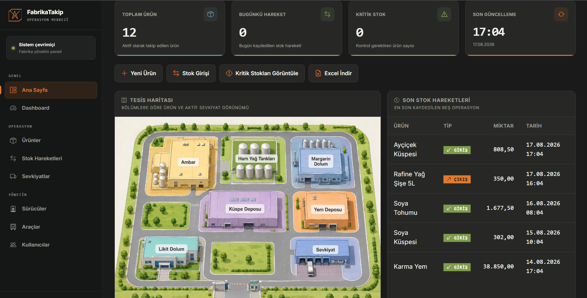
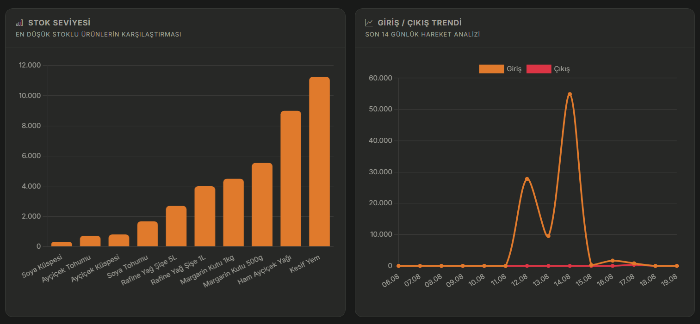
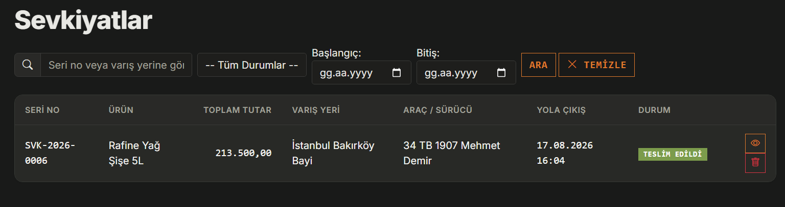
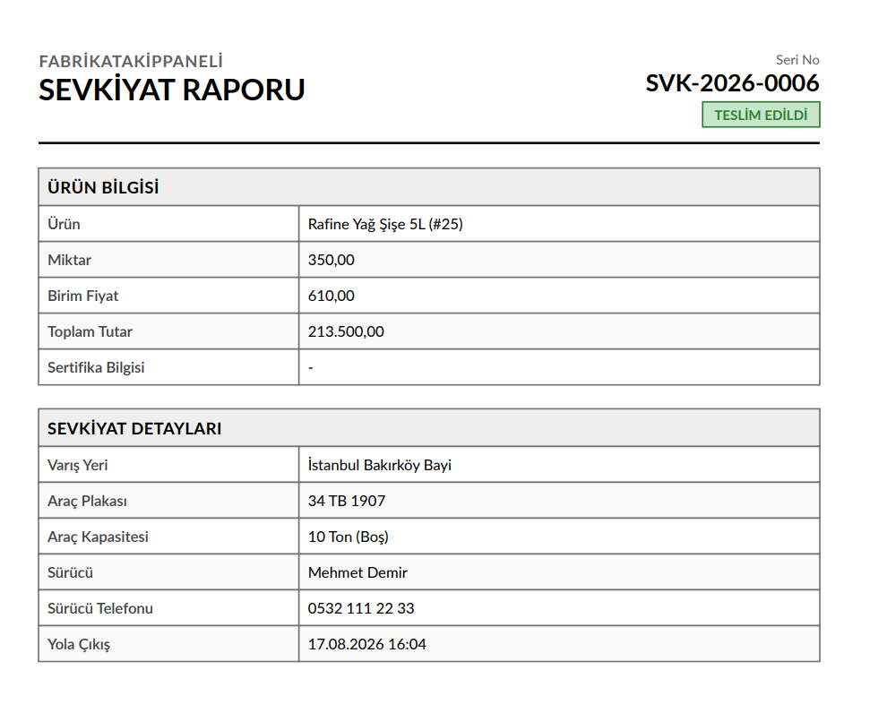
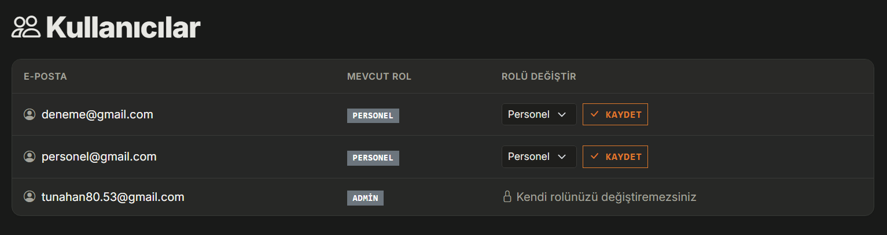

# FabrikaTakipPaneli

Bir fabrika/üretim tesisinin ürün ve stok hareketlerini takip etmek için yazdığım, rol bazlı yetkilendirmeye sahip bir yönetim paneli. Yöneticiler ürün tanımlarını, sürücü/araç kayıtlarını ve kullanıcı rollerini yönetiyor; personel ürünlere stok girişi/çıkışı işliyor; herkes anlık stok durumunu ve tesis haritasını Ana Sayfa'dan takip edebiliyor.

## Ekran Görüntüleri

**Ana Sayfa** — KPI kartları, bölüm bazlı tesis haritası ve son stok hareketleri


**Dashboard grafikleri** — en düşük stoklu ürünler ve 14 günlük giriş/çıkış trendi


**Sevkiyatlar** — seri no, varış yeri, durum ve tarihe göre filtrelenebilen sevkiyat listesi


**Sevkiyat raporu** — her sevkiyat için indirilebilen PDF çıktısı


**Kullanıcılar** — Admin panelinden rol atama


## Kullanılan Teknolojiler

- ASP.NET Core (Razor Pages) — .NET 10
- Entity Framework Core 9.0.18 + Pomelo.EntityFrameworkCore.MySql — MySQL erişimi
- ASP.NET Core Identity — kullanıcı girişi, kayıt ve rol yönetimi
- ClosedXML — Excel (.xlsx) export
- QuestPDF — sevkiyat raporu PDF üretimi (Community lisans)
- Chart.js — Dashboard grafikleri
- Bootstrap 5 + Bootstrap Icons — arayüz ve tema (açık/koyu)

## Özellikler

Projeyi geliştirirken eklediğim başlıca şeyler:

- **Giriş ve roller**: ASP.NET Core Identity ile giriş/kayıt; `Admin` ve `Personel` rolleri var, sayfalar `ViewProducts`, `ManageProducts`, `EnterStock`, `AdminOnly` gibi politikalarla korunuyor.
- **Ürün yönetimi**: Ürün adı, birim, kategori, konum, birim fiyat, minimum stok seviyesi ile CRUD — oluşturma/düzenleme/silme sadece Admin'e açık.
- **Stok hareketleri**: Ürün bazında giriş/çıkış kaydı; güncel stok, hareketlerin toplamından anlık hesaplanıyor. Bir çıkış mevcut stoktan fazlaysa (düzenlenen kaydın kendisi hariç tutularak) sunucu tarafında engelleniyor ve mevcut/istenen miktarı gösteren bir hata veriliyor.
- **Aynı gün düzenleme kuralı**: Personel sadece kendi girdiği ve aynı gün içinde oluşturulmuş hareketleri düzenleyip silebiliyor; Admin'in tüm kayıtlar üzerinde tam yetkisi var.
- **Sevkiyat takibi**: Bir çıkış hareketi oluşturulurken isteğe bağlı olarak varış yeri, araç/sürücü, yola çıkış zamanı, tahmini süre gibi sevkiyat bilgileri eklenebiliyor. Her sevkiyata otomatik ve benzersiz bir seri no atanıyor (`SVK-{yıl}-{sıra}`), durumu (Yolda / Teslim Ediliyor / Teslim Edildi) yola çıkış zamanı ve tahmini süreye göre kendiliğinden hesaplanıyor — Admin gerekirse elle de değiştirebiliyor. Her sevkiyat için PDF rapor indirilebiliyor.
- **Sürücü ve araç yönetimi**: Admin, sürücü (ad, T.C. kimlik no, telefon, ehliyet no) ve araç (plaka, kapasite, araç tipi) kayıtlarını tutuyor; sevkiyat oluştururken buradan seçiliyor.
- **Tesis haritası**: Ana Sayfa'da bölüm bazlı görsel bir yerleşim planı var — her bölüm o bölümdeki ürünleri ve varsa aktif sevkiyatları gösteriyor.
- **Dashboard**: Toplam ürün/hareket sayısı, bugünkü hareket ve kritik stok gibi KPI'lar; en düşük stoklu ürünler grafiği; son 14 günün giriş/çıkış trendi; son hareketler; konum bazlı stok özeti.
- **Arama, filtreleme, sayfalama**: Ürünlerde isme göre arama; stok hareketlerinde ürün/tarih filtreleri ve canlı öneri sunan hızlı arama kutusu; sevkiyatlarda seri no/varış yeri/durum/tarih filtreleri; tüm listelerde sayfalama.
- **Minimum stok uyarısı**: Ürün bazlı tanımlanan eşiğin altına düşenler Dashboard'da kritik olarak işaretleniyor.
- **Kullanıcı rol yönetimi**: Admin panelinden kayıtlı kullanıcıların rolü değiştirilebiliyor (kendi rolünü değiştiremiyor).
- **Excel export**: Stok hareketleri listesi, uygulanan filtrelerle birlikte `.xlsx` olarak indirilebiliyor.
- **Açık/koyu tema**: Sağ üstteki düğmeyle geçiş yapılabiliyor, tercih `localStorage`'da tutuluyor.
- **tr-TR yerelleştirme**: Uygulama genelinde Türkçe kültür ve sayı/tarih formatı kullanılıyor.

## Kurulum

### Gereksinimler

- [.NET SDK 10](https://dotnet.microsoft.com/download)
- Çalışan bir MySQL sunucusu (yerel ya da uzak)

### Adımlar

1. Bağımlılıkları yükle

   ```bash
   dotnet restore
   ```

2. Veritabanı bağlantısını user-secrets ile ayarla

   `appsettings.json` içindeki `DefaultConnection` sadece bir örnek — gerçek şifreyi oraya yazmak yerine proje klasöründe user-secrets kullan:

   ```bash
   cd FabrikaTakipPaneli
   dotnet user-secrets init
   dotnet user-secrets set "ConnectionStrings:DefaultConnection" "Server=localhost;Port=3306;Database=FabrikaTakipPaneli;User=root;Password=<gercek-sifreniz>;"
   ```

3. Migration'ları uygulayıp veritabanını oluştur

   ```bash
   dotnet ef database update
   ```

4. (Opsiyonel) İlk admin kullanıcıyı belirle

   `appsettings.json` içindeki `SeedAdmin:Email` alanına, kayıt olduktan sonra Admin rolü verilecek e-posta adresini yaz. Uygulama her başlangıçta bu kullanıcıyı (varsa) Admin rolüne ekliyor.

5. Uygulamayı çalıştır

   ```bash
   dotnet run
   ```

   Varsayılan olarak `http://localhost:5257` üzerinden açılıyor (HTTPS ile çalıştırmak istersen `dotnet run --launch-profile https`, o zaman `https://localhost:7218` üzerinden). Önce Identity üzerinden bir hesap oluşturup giriş yapman gerekiyor.

## Proje Yapısı

- `Models/` — `Product`, `StockEntry` / `StockEntryType`, `Shipment` / `ShipmentStatus` / `ShipmentSequence`, `Driver`, `Vehicle`.
- `Data/` — `ApplicationDbContext` ve açılışta rolleri/ilk admini oluşturan `RoleSeeder`.
- `Authorization/` — rol sabitleri (`AppRoles`), yetkilendirme politikaları (`AppPolicies`), stok hareketi düzenleme yetkisini kontrol eden `StockEntryAccess`.
- `Services/` — `ShipmentOrderNumberGenerator` (yıl bazlı, eşzamanlılığa karşı güvenli seri no üretimi) ve `ShipmentPdfDocument` (QuestPDF ile rapor üretimi).
- `Pages/` — `Products/`, `StockEntries/`, `Shipments/`, `Drivers/`, `Vehicles/`, `Dashboard/`, `Admin/Users/` ve kimlik doğrulama sayfaları (`Areas/Identity`).
- `Migrations/` — EF Core migration geçmişi.
- `wwwroot/` — statik dosyalar: CSS (`site.css`, `theme.css`), JS (tema geçişi vb.), Bootstrap/Chart.js/jQuery.

## Planlanan Geliştirmeler

- Sipariş takibi
- Stok hareketleri ve sevkiyat durumu için bildirim/e-posta uyarıları (kritik stok, teslim edildi vb.)
