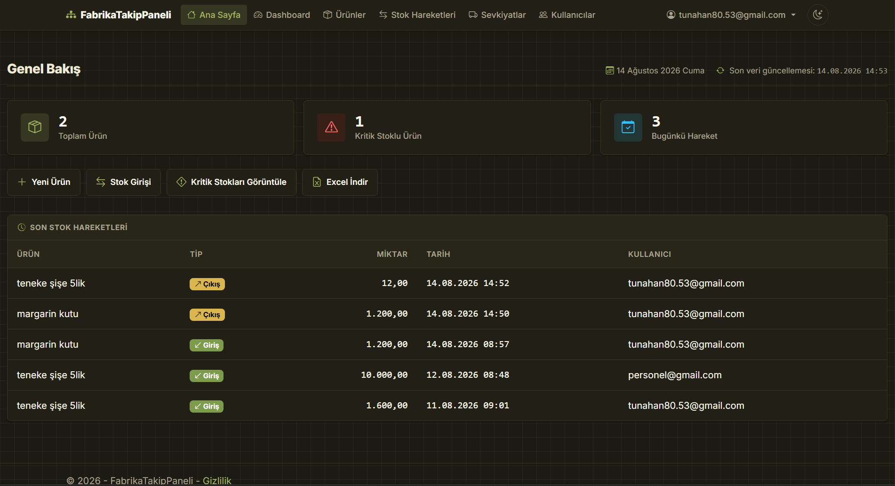

# FabrikaTakipPaneli

Bir fabrika/üretim tesisinin ürün ve stok hareketlerini takip etmek için geliştirilmiş, rol bazlı yetkilendirmeye sahip bir yönetim panelidir. Yöneticiler ürün tanımlarını ve kullanıcı rollerini yönetir; personel ürünlere stok girişi/çıkışı işler; herkes anlık stok durumunu Dashboard üzerinden izler.

## Ekran Görüntüsü



## 🧱 Kullanılan Teknolojiler

- **ASP.NET Core (Razor Pages)** — .NET 10
- **Entity Framework Core 9.0.18** + **Pomelo.EntityFrameworkCore.MySql** — MySQL veritabanı erişimi
- **ASP.NET Core Identity** — kullanıcı girişi, kayıt ve rol yönetimi
- **ClosedXML** — Excel (.xlsx) export
- **QuestPDF** — sevkiyat raporu PDF üretimi (Community lisans)
- **Chart.js** — Dashboard grafikleri
- **Bootstrap 5 + Bootstrap Icons** — arayüz ve tema (açık/koyu)

## ✨ Özellikler

- **Kullanıcı girişi ve rol bazlı yetkilendirme**: ASP.NET Core Identity ile giriş/kayıt; `Admin` ve `Personel` rolleri, sayfa/klasör bazlı yetkilendirme politikalarıyla (`ViewProducts`, `ManageProducts`, `EnterStock`, `AdminOnly`) korunuyor.
- **Ürün yönetimi**: Ürün adı, birim, kategori, konum, birim fiyat ve minimum stok seviyesi ile CRUD işlemleri (oluşturma/düzenleme/silme sadece Admin rolüne açık).
- **Stok hareketi yönetimi**: Ürün bazında giriş/çıkış kaydı, miktar, birim fiyat, tarih ve not girilebiliyor; güncel stok, giriş-çıkış hareketlerinin toplamından anlık hesaplanıyor.
- **Yetersiz stok koruması**: Bir çıkış hareketi mevcut stoktan fazla miktar içeriyorsa (oluşturma veya düzenleme sırasında, düzenlenen kaydın kendisi hesaplamadan hariç tutularak) sunucu tarafında engelleniyor ve mevcut/istenen miktarı gösteren bir hata mesajı veriliyor.
- **Aynı gün düzenleme kuralı**: Personel rolündeki kullanıcılar yalnızca kendi oluşturdukları ve **aynı gün içinde** girilmiş stok hareketlerini düzenleyebilir/silebilir; Admin tüm kayıtlar üzerinde tam yetkiye sahip.
- **Sevkiyat takibi**: Bir çıkış hareketi oluşturulurken isteğe bağlı olarak sevkiyat bilgisi (varış yeri, araç/sürücü, yola çıkış zamanı, tahmini süre, sertifika bilgisi) eklenebiliyor; her sevkiyata otomatik, benzersiz bir seri no atanıyor (`SVK-{yıl}-{sıra}`). Sevkiyat durumu (Yolda / Teslim Ediliyor / Teslim Edildi) yola çıkış zamanı ve tahmini süreye göre anlık hesaplanıyor, Admin gerektiğinde durumu manuel olarak da ayarlayabiliyor. Her sevkiyat için ürün, miktar, toplam tutar ve sevkiyat detaylarını içeren bir PDF rapor indirilebiliyor.
- **Dashboard**: Toplam ürün/stok hareketi sayısı, bugünkü hareket sayısı ve kritik stok sayısı gibi KPI'lar; en düşük stoklu ürünler listesi ve grafiği; son 14 günün giriş/çıkış trend grafiği (yeşil/kırmızı ile net ayrışan renkler); son hareketler listesi; konum bazlı stok özeti (Chart.js ile görselleştirilmiş).
- **Arama, filtreleme ve sayfalama**: Ürün listesinde isme göre arama; stok hareketlerinde ürün adına, tarih aralığına göre filtreleme; stok hareketleri listesinin üstünde canlı öneriler sunan hızlı ürün arama kutusu; sevkiyat listesinde seri no/varış yeri/durum/tarih filtreleri; tüm listelerde sayfalama.
- **Minimum stok eşiği uyarısı**: Ürün bazında tanımlanan minimum stok seviyesinin altına düşen ürünler Dashboard'da kritik olarak işaretleniyor.
- **Kullanıcı rol yönetimi (Admin)**: Admin panelinden kayıtlı kullanıcıların rolleri (`Admin`/`Personel`) değiştirilebiliyor; kullanıcı kendi rolünü değiştiremiyor.
- **Excel export**: Stok hareketleri listesi, uygulanan arama/tarih filtreleriyle birlikte `.xlsx` olarak indirilebiliyor.
- **Açık/koyu tema desteği**: Sağ üstteki tema düğmesiyle açık/koyu tema arasında geçiş yapılabiliyor, tercih `localStorage`'da saklanıyor.
- **tr-TR yerelleştirme**: Uygulama genelinde Türkçe kültür (`tr-TR`) ve sayı/tarih formatı kullanılıyor.

## 🚀 Kurulum ve Çalıştırma

### Gereksinimler

- [.NET SDK 10](https://dotnet.microsoft.com/download)
- Çalışan bir MySQL sunucusu (yerel veya uzak)

### Adımlar

1. **Bağımlılıkları yükleyin**

   ```bash
   dotnet restore
   ```

2. **Veritabanı bağlantısını user-secrets ile ayarlayın**

   `appsettings.json` içindeki `DefaultConnection` sadece bir örnektir; gerçek şifreyi buraya yazmak yerine proje klasöründe user-secrets kullanın:

   ```bash
   cd FabrikaTakipPaneli
   dotnet user-secrets init
   dotnet user-secrets set "ConnectionStrings:DefaultConnection" "Server=localhost;Port=3306;Database=FabrikaTakipPaneli;User=root;Password=<gercek-sifreniz>;"
   ```

3. **Migration'ları uygulayarak veritabanını oluşturun**

   ```bash
   dotnet ef database update
   ```

4. **(Opsiyonel) İlk admin kullanıcıyı belirleyin**

   `appsettings.json` içindeki `SeedAdmin:Email` alanına, kayıt olduktan sonra Admin rolü verilecek e-posta adresini yazın. Uygulama her başlangıçta bu kullanıcıyı (varsa) Admin rolüne ekler.

5. **Uygulamayı çalıştırın**

   ```bash
   dotnet run
   ```

   Uygulama varsayılan olarak `https://localhost:5001` (veya konsolda belirtilen adres) üzerinden erişilebilir olacaktır. Önce Identity üzerinden bir hesap oluşturup giriş yapmanız gerekir.

## 📁 Proje Yapısı

- **`Models/`** — Veritabanı varlıkları: `Product` (ürün), `StockEntry` (stok hareketi), `StockEntryType` (giriş/çıkış enum'u), `Shipment` (sevkiyat), `ShipmentStatus` (canlı durum enum'u), `ShipmentSequence` (seri no sayaç tablosu).
- **`Data/`** — `ApplicationDbContext` (EF Core context) ve `RoleSeeder` (uygulama açılışında rolleri ve ilk admini oluşturan seed servisi).
- **`Authorization/`** — Rol sabitleri (`AppRoles`), yetkilendirme politikaları (`AppPolicies`) ve stok hareketi düzenleme yetkisini kontrol eden `StockEntryAccess`.
- **`Services/`** — `ShipmentOrderNumberGenerator` (eşzamanlılığa karşı güvenli, yıl bazlı sevkiyat seri no üretimi) ve `ShipmentPdfDocument` (QuestPDF ile sevkiyat raporu üretimi).
- **`Pages/`** — Razor Pages sayfaları: `Products/`, `StockEntries/`, `Shipments/`, `Dashboard/`, `Admin/Users/` ve kimlik doğrulama sayfaları (`Areas/Identity`).
- **`Migrations/`** — EF Core veritabanı migration geçmişi.
- **`wwwroot/`** — Statik dosyalar: CSS (`site.css`, `theme.css`), JS (tema geçişi vb.) ve üçüncü parti kütüphaneler (Bootstrap, Chart.js, jQuery).

## 🗺️ Planlanan Geliştirmeler

- Bölüm/konum bazlı görsel harita (depo yerleşim planı) görünümü
- Sipariş takibi
- Stok hareketleri ve sevkiyat durumu için bildirim/e-posta uyarıları (kritik stok, teslim edildi vb.)
